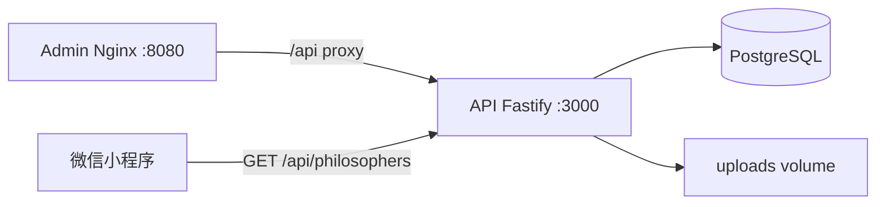

# 部署指南

## Docker Compose 一键部署（推荐）

### 1. 准备环境变量

```bash
cp .env.example .env
# 编辑 .env，至少修改 JWT_SECRET 和 ADMIN_PASSWORD
```

### 2. 启动全部服务

```bash
docker compose up -d --build
```

服务地址：

| 服务 | 地址 |
|------|------|
| API | http://localhost:3000 |
| 管理后台 | http://localhost:8080 |
| PostgreSQL | localhost:5432 |

### 3. 登录管理后台

- 地址：http://localhost:8080
- 默认账号：`admin` / `admin123`（或 `.env` 中配置的值）

首次启动 API 会自动：

1. 执行数据库迁移（建表）
2. 创建管理员账号（若 users 表为空）
3. 导入 8 位哲学家 seed 数据

### 4. 小程序对接

将 `src/services/api.ts` 中的 `API_BASE_URL` 改为你的 API 公网地址：

```typescript
export const API_BASE_URL = 'https://api.yourdomain.com'
```

在微信公众平台配置 request 合法域名。

---

## 本地开发（不使用 Docker 跑 API）

### 仅启动 PostgreSQL

```bash
docker compose up -d postgres
```

### 配置 API 环境变量

```bash
cp services/api/.env.example services/api/.env
```

### 启动服务

```bash
yarn install
yarn dev:api      # http://localhost:3000
yarn dev:admin    # http://localhost:5173（Vite 已代理 /api）
yarn dev:weapp    # 微信小程序
```

---

## 生产环境建议

1. **JWT_SECRET**：使用 32 位以上随机字符串
2. **ADMIN_PASSWORD**：首次部署后立即修改默认密码（需后续支持改密或手动更新数据库）
3. **PUBLIC_API_URL**：设为 API 对外 HTTPS 地址，确保头像 URL 正确
4. **CORS_ORIGIN**：仅允许管理后台域名
5. **PostgreSQL**：使用托管数据库或持久化 volume
6. **头像存储**：当前为本地 `uploads/`，生产可考虑 OSS/COS + CDN
7. **HTTPS**：在 API / Admin 前加 Nginx 或云负载均衡终止 SSL

---

## 架构



## 鉴权说明

- **公开接口**：`GET /api/philosophers`、`GET /api/philosophers/:id`、`GET /api/health`
- **需登录**：创建/编辑/删除哲学家、上传头像
- **方式**：`POST /api/auth/login` 获取 JWT，请求头携带 `Authorization: Bearer <token>`
